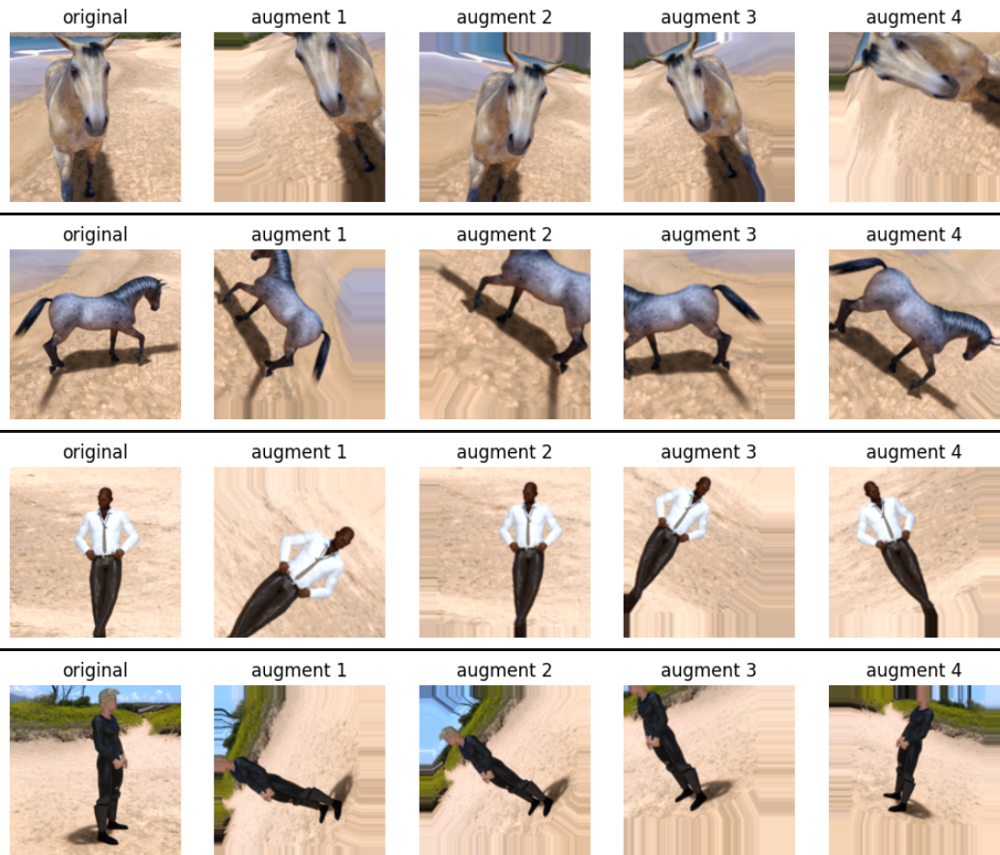

# Horses vs Humans Image Classifier 🐴🤷

[](https://www.tensorflow.org/)
[](https://www.python.org/)
[](https://keras.io/)
[](https://numpy.org/)
[](https://matplotlib.org/)

This repository contains a convolutional neural network (CNN) implementation for classifying images of horses and humans using TensorFlow and Keras. The project demonstrates the effect of image size on model training and performance, as well as techniques to improve generalization through data augmentation.


---

## Table of Contents 📋
- [Project Overview](#project-overview-)
- [Dataset Details](#dataset-details-)
- [Model Architecture](#model-architecture-)
- [Training Process](#training-process-)
- [Data Augmentation](#data-augmentation-)
- [Results](#results-)
- [Visualizations](#visualizations-)
- [Getting Started](#getting-started-)
- [Key Observations](#key-observations-)
- [Future Improvements](#future-improvements-)
- [Contact](#contact-)
- [License](#license-)
- [Acknowledgments](#acknowledgments-)

---

## Project Overview 🔎

The main goal of this project is to build and train a CNN that can accurately classify whether an image contains a horse or a human. Unlike simpler classification tasks, this project demonstrates how to work with real-world images using neural networks.

This project explores:
- Using compacted images (150x150) to improve training speed
- How changing image size affects the model architecture
- The trade-off between model size, training time, and accuracy
- Techniques for data preprocessing and visualization
- Implementing data augmentation to improve model generalization

**Development Phases:**
1. **Basic CNN Model**: Implementation of a baseline convolutional neural network
2. **Data Augmentation**: Enhancement with image augmentation techniques to reduce overfitting

---

## Dataset Details 📊

The project uses two datasets:
- `horse-or-human`: Training set with 500 horse images and 527 human images
- `validation-horse-or-human`: Validation set with 128 horse images and 128 human images

These datasets consist of color images (RGB) that will be resized to 150x150 pixels.

**Data Preprocessing:**
- Images are normalized from 0-255 pixel values to 0-1 range
- Data is organized in the following directory structure:
  ```
  horse-or-human/
  ├── horses/
  │   ├── horse01.png
  │   ├── horse02.png
  │   └── ...
  └── humans/
      ├── human01.png
      ├── human02.png
      └── ...
  ```
- Dataset is loaded using TensorFlow's image_dataset_from_directory API

## Model Architecture 🧠

### Phase 1: Basic CNN Model

The implemented CNN has the following structure:

```python
model = tf.keras.models.Sequential([
    # Input layer accepting 150x150 RGB images
    tf.keras.Input(shape=(150, 150, 3)),
    # First convolutional layer
    tf.keras.layers.Conv2D(16, (3,3), activation='relu'),
    tf.keras.layers.MaxPooling2D(2, 2),
    # Second convolutional layer
    tf.keras.layers.Conv2D(32, (3,3), activation='relu'),
    tf.keras.layers.MaxPooling2D(2,2),
    # Third convolutional layer
    tf.keras.layers.Conv2D(64, (3,3), activation='relu'),
    tf.keras.layers.MaxPooling2D(2,2),
    # Flatten the results
    tf.keras.layers.Flatten(),
    # Dense hidden layer
    tf.keras.layers.Dense(512, activation='relu'),
    # Output layer (0 for horses, 1 for humans)
    tf.keras.layers.Dense(1, activation='sigmoid')
])
```

**Architecture Breakdown:**
- **Input Layer**: Accepts 150x150 RGB images (3 channels)
- **Convolutional Layers**: Three layers of increasing complexity (16→32→64 filters)
- **Pooling Layers**: Max pooling with 2x2 windows to reduce spatial dimensions
- **Flatten Layer**: Converts 2D feature maps to 1D vector for dense layers
- **Dense Hidden Layer**: 512 neurons with ReLU activation for non-linearity
- **Output Layer**: Single neuron with sigmoid activation (0 for horse, 1 for human)

The model uses approximately 9.5 million trainable parameters, with most concentrated in the dense layer after flattening.

## Training Process 🔄

The model is trained using:
- RMSprop optimizer with learning rate of 0.001
- Binary cross-entropy loss function
- Normalized image data (scaled to 0-1 range)
- 15 epochs of training

```python
# Compile model with appropriate loss function and optimizer
model.compile(loss='binary_crossentropy',
              optimizer=tf.keras.optimizers.RMSprop(learning_rate=0.001),
              metrics=['accuracy'])

# Train the model
history = model.fit(
    train_dataset_final,
    epochs=15,
    validation_data=validation_dataset_final,
    verbose=2)
```

The training process includes:
- Data normalization through a rescaling layer (1/255)
- Dataset shuffling with buffer size of 1000
- TensorFlow's data prefetching to optimize training speed
- Verbose logging to track accuracy and loss metrics

## Data Augmentation 🔄

### Phase 2: Enhancing Model Generalization

Data augmentation artificially expands the training dataset by creating modified versions of existing images. This technique is particularly valuable for the Horses vs Humans dataset, where the number of training examples is limited (only 500 horse images and 527 human images).



**Benefits for This Project:**
- **Combats Overfitting**: The baseline model reached 100% training accuracy but only 85.6% validation accuracy
- **Diversifies the Dataset**: Creates variations from existing images, simulating different poses and viewing conditions
- **Improves Real-World Performance**: Helps the model handle variations in lighting, angles, and backgrounds

### Implementation

Data augmentation is implemented through TensorFlow's image augmentation layers:

```python
data_augmentation = tf.keras.Sequential([
  tf.keras.layers.RandomFlip("horizontal"),
  tf.keras.layers.RandomRotation(0.2),
  tf.keras.layers.RandomZoom(0.2),
  tf.keras.layers.RandomHeight(0.2),
  tf.keras.layers.RandomWidth(0.2),
])

# Apply augmentation to the model pipeline
augmented_model = tf.keras.Sequential([
  tf.keras.Input(shape=(150, 150, 3)),
  data_augmentation,
  tf.keras.layers.Rescaling(1./255),
  # Rest of the model architecture remains the same
  tf.keras.layers.Conv2D(16, (3,3), activation='relu'),
  tf.keras.layers.MaxPooling2D(2, 2),
  tf.keras.layers.Conv2D(32, (3,3), activation='relu'),
  tf.keras.layers.MaxPooling2D(2,2),
  tf.keras.layers.Conv2D(64, (3,3), activation='relu'),
  tf.keras.layers.MaxPooling2D(2,2),
  tf.keras.layers.Flatten(),
  tf.keras.layers.Dense(512, activation='relu'),
  tf.keras.layers.Dense(1, activation='sigmoid')
])
```

**Augmentation Techniques:**
- **Horizontal Flipping**: Mirrors images left-to-right
- **Rotation (±20%)**: Rotates images to various angles
- **Zooming (±20%)**: Simulates distance variations
- **Height/Width Adjustments (±20%)**: Creates variations in aspect ratio

### Performance Improvements


Comparing the baseline and augmented models:

| Metric | Baseline Model | Augmented Model | Change |
|--------|---------------|-----------------|--------|
| Training Accuracy | 100.0% | 94.3% | -5.7% |
| Validation Accuracy | 85.6% | 91.8% | +6.2% |
| Overfitting Gap | 14.4% | 2.5% | -11.9% |
| Training Time/Epoch | ~7s | ~9s | +2s |

### Key Observations

1. **Improved Generalization**: The validation accuracy increased by 6.2%, showing better performance on unseen data
2. **Reduced Overfitting**: The gap between training and validation accuracy decreased from 14.4% to just 2.5%
3. **Slower Convergence**: The augmented model required more epochs to reach peak performance
4. **More Robust Features**: The model became less sensitive to specific image details and more focused on essential features

The slightly lower training accuracy with data augmentation is actually a positive sign—it indicates the model is learning more generalizable features rather than memorizing the training examples.

## Results 📈

Performance comparison across the two phases:

| Model Phase     | Training Accuracy | Validation Accuracy | Training Time/Epoch | Parameters |
|-----------------|-------------------|---------------------|---------------------|------------|
| Basic CNN       | 100.0%            | 85.6%               | ~7s                 | 9.5M       |
| With Augmentation | 94.3%           | 91.8%               | ~9s                 | 9.5M       |

**Key Observations:**
- **Basic CNN**: Shows significant overfitting (100% training accuracy vs. 85.6% validation)
- **Data Augmentation**: Reduces overfitting and improves generalization by over 6%

The baseline model shows signs of overfitting around epoch 5, where training accuracy continues to improve while validation accuracy plateaus. The augmented model maintains a much closer relationship between training and validation metrics.

**Architecture Comparison:**

| Image Size | Parameters | Training Time | Peak Validation Accuracy |
|------------|------------|---------------|--------------------------|
| 150×150    | 9.5M       | ~7s/epoch     | ~87% (baseline), ~92% (augmented) |
| 300×300    | 38M        | ~30s/epoch    | ~88% (baseline)          |

Using smaller images (150×150) with data augmentation provides better accuracy with 75% fewer parameters and significantly faster training times compared to larger (300×300) images without augmentation.

## Visualizations 📊

The repository includes code for various visualizations to help understand model performance and behavior:

### Training Metrics

*Example visualization showing training and validation accuracy across epochs*

### Intermediate Layer Activations
The notebook includes code to visualize what different convolutional layers are "seeing" in the images:

```python
# Display the representations
for layer_name, feature_map in zip(layer_names, successive_feature_maps):
  if len(feature_map.shape) == 4:
    # Just do this for the conv / maxpool layers, not the fully-connected layers
    n_features = feature_map.shape[-1]  # number of features in feature map
    size = feature_map.shape[1]  # feature map shape (1, size, size, n_features)
    
    # Tile the images in this matrix
    display_grid = np.zeros((size, size * n_features))
    for i in range(n_features):
      x = feature_map[0, :, :, i]
      x -= x.mean()
      x /= x.std()
      x *= 64
      x += 128
      x = np.clip(x, 0, 255).astype('uint8')
      display_grid[:, i * size : (i + 1) * size] = x
      
    # Display the grid
    scale = 20. / n_features
    plt.figure(figsize=(scale * n_features, scale))
    plt.title(layer_name)
    plt.grid(False)
    plt.imshow(display_grid, aspect='auto', cmap='viridis')
```

### Interactive Predictions
The notebook contains an interactive widget for uploading and classifying new images:


*Example of the prediction widget interface*

---

## Transfer Learning 🚀

### Phase 3: Leveraging Pre-trained Knowledge

Transfer learning represents the most advanced approach in this project, using InceptionV3 (a model pre-trained on ImageNet) to achieve superior results with minimal training time.

```python
def create_transfer_learning_model(pre_trained_model, last_output):
    # Flatten the output layer of the pretrained model
    x = tf.keras.layers.Flatten()(last_output)
    
    # Add custom classification layers
    x = tf.keras.layers.Dense(1024, activation='relu')(x)
    x = tf.keras.layers.Dropout(0.2)(x)
    x = tf.keras.layers.Dense(1, activation='sigmoid')(x)
    
    # Create the complete model
    model = tf.keras.Model(inputs=pre_trained_model.input, outputs=x)
    
    # Compile with a very low learning rate
    model.compile(
        optimizer=tf.keras.optimizers.RMSprop(learning_rate=0.00001),
        loss='binary_crossentropy',
        metrics=['accuracy']
    )
    
    return model
```

**Implementation Highlights:**
* **Feature Extraction**: Uses the 'mixed7' layer from InceptionV3 as a sophisticated feature extractor
* **Frozen Base Model**: All pre-trained layers are kept non-trainable to preserve learned features
* **Minimal Custom Layers**: Just three additional layers are needed on top of the pre-trained model
* **Specialized Preprocessing**: Images are prepared specifically for InceptionV3 using its dedicated preprocessing function

**Performance Improvements:**
* **Superior Accuracy**: 98.5% validation accuracy (6.7% improvement over the augmented model)
* **Ultra-Fast Convergence**: Reaches optimal performance in less than 5 epochs
* **Excellent Generalization**: Minimal gap between training and validation metrics, showing robust learning
* **Resource Efficiency**: Despite having more parameters (47.5M total, 38.5M trainable), the model trains faster due to knowledge transfer

This approach demonstrates how modern deep learning can achieve state-of-the-art results efficiently by building upon pre-trained models rather than starting from scratch.

---

## Key Observations 🔍

1. **Data Augmentation Impact**: Implementing augmentation increased validation accuracy from 85.6% to 91.8% without changing the model architecture
2. **Reduced Overfitting**: The gap between training and validation accuracy decreased from 14.4% to just 2.5% with augmentation
3. **Image Size Efficiency**: Using 150x150 images instead of 300x300 significantly reduced model size while maintaining good performance
4. **Feature Learning**: Early layers in the CNN learn basic features (edges, textures) while deeper layers capture more complex patterns
5. **Training Behavior**: The baseline model shows signs of overfitting after ~7 epochs (training accuracy at 100% while validation accuracy plateaus)

## Future Improvements 🚀

- **Transfer Learning**: Leverage pre-trained models like VGG16, ResNet, or MobileNet as feature extractors
  ```python
  base_model = tf.keras.applications.MobileNetV2(
      input_shape=(150, 150, 3),
      include_top=False,
      weights='imagenet'
  )
  base_model.trainable = False
  ```

- **Additional Regularization**: Further reduce overfitting with techniques beyond data augmentation
  ```python
  model = tf.keras.Sequential([
      # ... existing layers
      tf.keras.layers.Flatten(),
      tf.keras.layers.Dropout(0.5),  # Add dropout layer
      tf.keras.layers.Dense(512, activation='relu', kernel_regularizer=tf.keras.regularizers.l2(0.001)),
      tf.keras.layers.Dense(1, activation='sigmoid')
  ])
  ```

- **Model Architecture Refinements**:
  - Test different numbers of convolutional layers
  - Experiment with various filter counts (16, 32, 64, 128)
  - Try different kernel sizes for convolutions (3×3, 5×5)

- **Early Stopping**: Implement callbacks to halt training when validation accuracy plateaus
  ```python
  early_stopping = tf.keras.callbacks.EarlyStopping(
      monitor='val_accuracy',
      patience=3,
      restore_best_weights=True
  )
  ```

- **Learning Rate Scheduling**: Implement learning rate decay to fine-tune model convergence
  ```python
  lr_scheduler = tf.keras.callbacks.ReduceLROnPlateau(
      monitor='val_loss',
      factor=0.1,
      patience=2
  )
  ```

- **Class Activation Maps**: Implement Grad-CAM visualization to highlight which regions of images the model focuses on

- **Model Deployment**: Convert to TensorFlow Lite for mobile applications or TensorFlow.js for web interfaces

---

## License

This project is licensed under the MIT License - see the LICENSE file for details.

## Acknowledgments 🙏

- The dataset is provided as part of the ["TensorFlow in Practice" specialization on Coursera](https://www.coursera.org/specializations/tensorflow-in-practice)
- Inspired by the work of the TensorFlow team and Laurence Moroney
- Special thanks to the deep learning community for their valuable resources and tutorials
- Image examples courtesy of the [TensorFlow Datasets repository](https://github.com/tensorflow/datasets)
